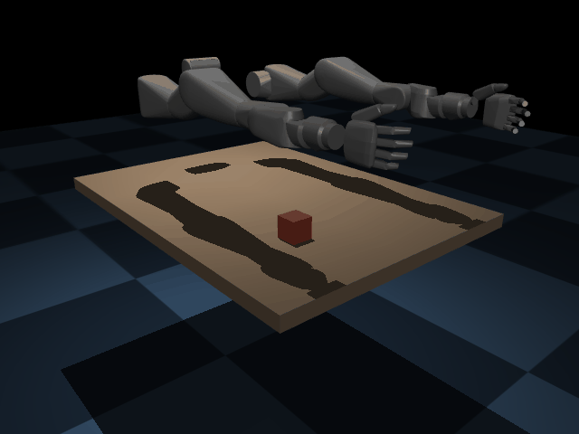

# vega_bimanual — RL manipulation *tracking* on the Dexmate Vega (MuJoCo)

> **Work in progress.** Reimplementing [DexTrack](https://github.com/Meowuu7/DexTrack)-style
> reinforcement-learning manipulation *tracking* on the bimanual
> [Dexmate Vega](https://www.dexmate.ai/) humanoid, in MuJoCo — single-arm first,
> bimanual as the goal.

<p align="center">
  
</p>

*Above: the policy's reference — the f5d6 hand reorienting a box ~140° on the table by
off-center pushing (nonprehensile manipulation).*

## What I'm trying to do

DexTrack learns a single RL policy that **tracks** kinematic references — a hand
trajectory plus an object's 6-DoF pose — so a dexterous hand reproduces real
manipulation. The original targets a 24-DoF Shadow Hand in Isaac Gym from
retargeted human (MANO/GRAB) grasps. The goal here is to bring that **method**
(not the code, which is Isaac-Gym-only) to the **Dexmate Vega** — a bimanual
mobile humanoid with 7-DoF arms and the underactuated **f5d6** 5-finger hand —
running entirely in **MuJoCo**, and to scale it to **coordinated bimanual**
manipulation.

## Approach

- **Env** (`dextrack_vega/envs`): per-arm-modular tracking env. Action space is
  DexTrack's **cumulative residual position targets with a kinematic bias**
  (`target = ref_qpos + Σ residual`), so the policy stays anchored to the
  reference while applying the corrections that make the motion dynamically
  feasible. Reward = object-pose + hand-pose (joint & fingertip) tracking, all
  bounded exponential kernels. Now generalizes from one arm (`side="R"`, 18-DoF
  action) to **two** (`sides=["R","L"]`, 36-DoF).
- **Assets** (`dextrack_vega/assets.py`): compiles the Vega-1U f5d6 URDF into a
  MuJoCo scene (strips `.glb` visuals MuJoCo can't decode, keeps `.obj`
  collision), adds a table, a manipulable object (box / cylinder / sphere) and
  position actuators.
- **References** (`scripts/make_demo.py`): physically-consistent demos generated
  in-sim via damped-least-squares IK (incl. a verified 6-DoF position+orientation
  IK) — `push`, `reorient`, plus a kinematic `lift_ref` builder.
- **Learning** (`scripts/train.py`): clean PPO (PyTorch), in-process vectorized
  envs.

## Status

| Piece | State |
|---|---|
| Single-arm tracking env + reward + PPO | ✅ working |
| **Push** task | ✅ learns (object-tracking error 80 → ~11 cm) |
| **Reorient** task (object yaw tracking) | ✅ demo + training |
| 6-DoF IK, object types, headless GIF render | ✅ |
| Bimanual env (36-DoF action) | ✅ constructs & steps |
| Bimanual cooperative demo + training | 🚧 next |
| Human-grasp retargeting (GRAB/TACO → f5d6) | 🚧 scoped (`RETARGETING.md`) |
| Parallel sim (mujoco_warp) for throughput | 🚧 |

## A finding worth noting

The **f5d6 hand cannot achieve force closure** — a full thumb-joint-range search
shows the thumb can't oppose the fingers closer than ~3.1 cm, so it can't pinch,
enclose, lift, or do in-hand manipulation. The feasible (and trackable) repertoire
is therefore **nonprehensile**: pushing, pivoting and reorienting objects on a
support surface — which is what the current tasks target, and which extends
naturally to two-arm cooperative manipulation.

## Run

```bash
# generate a reference demo
PYTHONPATH=. python scripts/make_demo.py --task reorient --out demos/reorient_box.npz

# train the tracker on it
PYTHONPATH=. python scripts/train.py --ref demos/reorient_box.npz --total-steps 250000

# visualize (kinematic playback of a reference)
./run_viz.sh --ref demos/reorient_box.npz --playback

# render a demo to GIF (headless)
MUJOCO_GL=egl PYTHONPATH=. python scripts/render_gif.py --ref demos/reorient_box.npz --out media/reorient.gif
```
