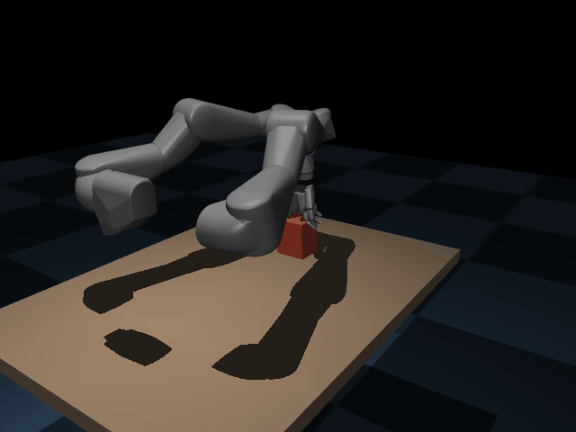
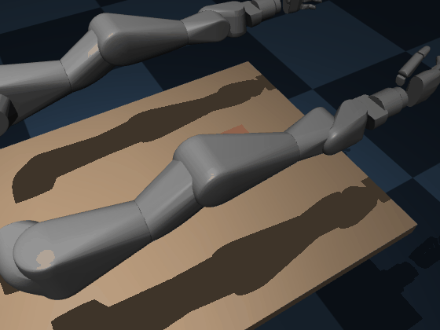

# vega_bimanual — RL manipulation *tracking* on the Dexmate Vega (MuJoCo)

> **Work in progress.** Reimplementing [DexTrack](https://github.com/Meowuu7/DexTrack)-style
> reinforcement-learning manipulation *tracking* on the bimanual
> [Dexmate Vega](https://www.dexmate.ai/) humanoid, in MuJoCo — single-arm first,
> bimanual as the goal.

<p align="center">
  
</p>

*Above: a bimanual cooperative squeeze-and-lift, executed **open-loop in full
physics** (no kinematic locking) — the two f5d6 hands press opposite faces of a
box and lift it ~21 cm off the table, held purely by inter-hand friction. This is
the one manipulation a **single** f5d6 hand cannot do (its thumb can't oppose the
fingers closer than ~3.1 cm); the second hand provides the missing object
opposition. f5d6's weak opposition caps the liftable mass — the squeeze holds a
0.05 kg box but slips on 0.12 kg.*

<p align="center">
  
</p>

*A second bimanual task — **cooperative reorient**: both hands contact the box's
opposite ±y faces and sweep tangentially in **opposite** x directions. The two
opposing tangential drags form a couple about z, yawing the box **+111°**.
Nonprehensile (no force closure needed), so it doesn't depend on the marginal
friction grip that limits the lift.*

<p align="center">
  
</p>

*Single-arm reorient for comparison: one f5d6 hand yawing a box ~140° by
off-center pushing.*

## What I'm trying to do

DexTrack learns a single RL policy that **tracks** kinematic references — a hand
trajectory plus an object's 6-DoF pose — so a dexterous hand reproduces real
manipulation. The original targets a 24-DoF Shadow Hand in Isaac Gym from
retargeted human (MANO/GRAB) grasps. The goal here is to bring that **method**
(not the code, which is Isaac-Gym-only) to the **Dexmate Vega** — a bimanual
mobile humanoid with 7-DoF arms and the underactuated **f5d6** 5-finger hand —
running entirely in **MuJoCo**, and to scale it to **coordinated bimanual**
manipulation.

## Approach

- **Env** (`dextrack_vega/envs`): per-arm-modular tracking env. Action space is
  DexTrack's **cumulative residual position targets with a kinematic bias**
  (`target = ref_qpos + Σ residual`, the residual **bounded** to a band around
  the reference so the policy corrects it but can't drift away — an unbounded
  residual let the bimanual arms walk to their joint limits). Reward =
  object-pose + hand-pose (joint & fingertip) tracking, all
  bounded exponential kernels. Now generalizes from one arm (`side="R"`, 18-DoF
  action) to **two** (`sides=["R","L"]`, 36-DoF).
- **Assets** (`dextrack_vega/assets.py`): compiles the Vega-1U f5d6 URDF into a
  MuJoCo scene (strips `.glb` visuals MuJoCo can't decode, keeps `.obj`
  collision), adds a table, a manipulable object (box / cylinder / sphere) and
  position actuators.
- **References** (`scripts/make_demo.py`): physically-consistent demos generated
  in-sim via damped-least-squares IK (incl. a verified 6-DoF position+orientation
  IK) — `push`, `reorient`, plus a kinematic `lift_ref` builder.
- **Learning** (`scripts/train.py`): clean PPO (PyTorch). Vectorized envs come in
  two backends (`dextrack_vega/envs/vec_env.py`): `sync` (in-process) and
  `process` (one env per core). On this 8-core Jetson the multi-core backend is
  ~2.8× faster (130 → ~366 steps/s); MJX isn't an option here (no JAX-CUDA wheels
  for aarch64/Tegra), so `mujoco_warp` is the eventual GPU path.

## Status

| Piece | State |
|---|---|
| Single-arm tracking env + reward + PPO | ✅ working |
| **Push** task | ✅ learns (object-tracking error 80 → ~11 cm) |
| **Reorient** task (object yaw tracking) | ✅ demo + training |
| 6-DoF IK, object types, headless GIF render | ✅ |
| Bimanual env (36-DoF action) | ✅ constructs & steps |
| **Bimanual squeeze-and-lift** (open-loop physics, +21 cm) | ✅ two hands lift a 0.05 kg box |
| **Bimanual cooperative reorient** (physics couple, +111° yaw) | ✅ two hands yaw a box on the table |
| Multi-core training (`ProcessVectorEnv`, ~2.8× on 8 cores) | ✅ |
| Bimanual *RL tracker* matching the open-loop lift | 🚧 partial (policy lifts ~4 cm; bottleneck is exploration, not physics — friction probe at 2×/5× had no effect) |
| Human-grasp retargeting (GRAB/TACO → f5d6) | 🚧 scoped (`RETARGETING.md`) |
| Parallel sim (mujoco_warp) for throughput | 🚧 |

## A finding worth noting

The **f5d6 hand cannot achieve force closure** — a full thumb-joint-range search
shows the thumb can't oppose the fingers closer than ~3.1 cm, so it can't pinch,
enclose, lift, or do in-hand manipulation. The feasible (and trackable) repertoire
is therefore **nonprehensile**: pushing, pivoting and reorienting objects on a
support surface — which is what the current tasks target, and which extends
naturally to two-arm cooperative manipulation.

## Run

```bash
# generate a reference demo
PYTHONPATH=. python scripts/make_demo.py --task reorient --out demos/reorient_box.npz

# bimanual cooperative reorient (couple yaws the box ~111°)
PYTHONPATH=. python scripts/make_demo.py --task bim_reorient --out demos/bim_reorient_box.npz

# bimanual cooperative squeeze-and-lift reference (36-DoF, two arms)
PYTHONPATH=. python scripts/make_demo.py --task bim_lift --out demos/bim_lift_box.npz
# render it executed OPEN-LOOP in physics (real dynamics; prints the net lift)
MUJOCO_GL=egl PYTHONPATH=. python scripts/render_gif.py \
    --ref demos/bim_lift_box.npz --sides R,L --openloop \
    --obj-type box --obj-mass 0.05 --obj-dims 0.04,0.045,0.07 --obj-pos 0.55,0.0,0.80 \
    --out media/bim_lift.gif

# train the bimanual tracker across all CPU cores (object must match the ref)
PYTHONPATH=. python scripts/train.py --ref demos/bim_lift_box.npz --sides R,L \
    --vec process --num-envs 12 --obj-mass 0.05 --obj-dims 0.04,0.045,0.07 \
    --obj-pos 0.55,0.0,0.80 --total-steps 800000

# train the tracker on it
PYTHONPATH=. python scripts/train.py --ref demos/reorient_box.npz --total-steps 250000

# visualize (kinematic playback of a reference)
./run_viz.sh --ref demos/reorient_box.npz --playback

# render a demo to GIF (headless)
MUJOCO_GL=egl PYTHONPATH=. python scripts/render_gif.py --ref demos/reorient_box.npz --out media/reorient.gif
```
